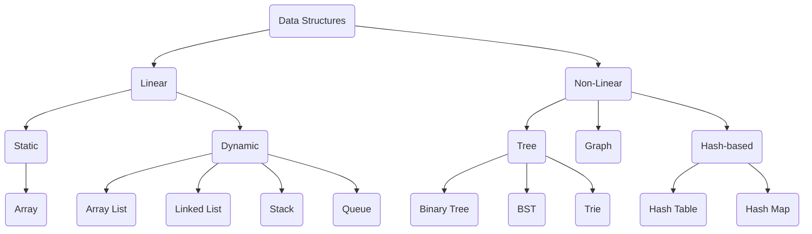

# coding-challenges
My solutions to various coding challenges and puzzles. Think of [Leetcode](https://leetcode.com/), [Neetcode](https://neetcode.io/), and [Cracking The Coding Interview](https://www.crackingthecodinginterview.com/)-style prompts solved in Java, Python, or Go. Exercises different data structure and algorithms.

### Data Structure

_FYI: This awesome flowchart was created using [Mermaid](https://docs.mermaidchart.com/mermaid/intro). 
Check it out, it's a charting and diagramming tool with text & code!_

### Algorithms
Not an extensive list, but includes:
* Linear Search
* Binary Search
* Breadth First Search
* Depth First Search
* 2-Pointer
* Sliding Window
* Linked List Manipulation
* Fast & Slow
* Backtracking
* Dynamic Programming
* Bit Manipulation

