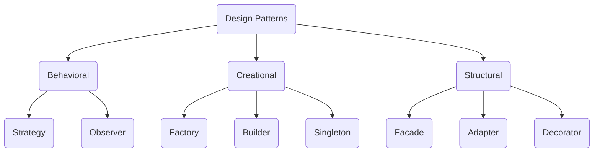

# design-patterns

Design patterns are a way to solve commonly occurring problems in software engineering. They are reusable, tested solutions to certain
software design problems. 

You can use one or more design in any software engineering problems! This repo showcases very simple and practical
demonstrations of each design pattern. 

_Note: This is not an exhaustive list of them!_

_Note: This awesome flowchart was created using Mermaid. Check it out, it's a charting and diagramming tool with text & code!_
